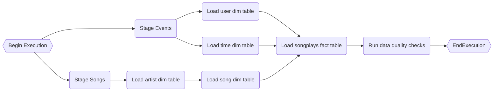

# Sparkify song play logs:  DataWarehouse and DataPipeline
This document describes how to create and load data to a realtional database for analysing songs and user activity on Sparkify (music streaming app).

Original datasets reside in S3, in a directory of JSON logs on user activity on the app, as well as a directory with JSON metadata on the songs in the app.

The data warehouse has been created in RedShift (cloud-computing platform Amazon Web Services - AWS) using a star schema. ETL pipeline that transfers the original  datasets into tables in RedShift from S3 has been implemented using Apache Airflow. 

# Table of Contents
1. [Project Description](#project-description)
2. [Original datasets](#original-datasets)
3. [Project Files](#project-files)
4. [Project Launching](#project-launching)
5. [Schema for Song Play Database](#schema-for-song-play-database)
6. [ETL process](#etl-process)
7. [Example queries and results for song play analysis](#example-queries-and-results-for-song-play-analysis)

# Project Description
A music streaming company, Sparkify, has decided that it is time to introduce more automation and monitoring to their data warehouse ETL pipelines and come to the conclusion that the best tool to achieve this is Apache Airflow.

Their data resided in S3, in a directory of JSON logs on user activity on the app, as well as a directory with JSON metadata on the songs in their app.

In this way, a Redshift datawarehouse with tables designed to optimize queries on song play analysis has been created and the original datasets have been loaded into it using Apache Airflow.
# Original datasets
Datasets with original datasets with JSON metadata of the songs and  JSON logs of user activity on the app reside in S3. Here are the S3 links for each:

-   Song data:  `s3://udacity-dend/song_data`
-   Log data:  `s3://udacity-dend/log_data`

Log data json path:  `s3://udacity-dend/log_json_path.json`

## Song Dataset
The first dataset is a subset of real data from the  [Million Song Dataset](http://millionsongdataset.com/). Each file is in JSON format and contains metadata about a song and the artist of that song. The files are partitioned by the first three letters of each song's track ID. For example, here are file paths to two files in this dataset.

```
song_data/A/B/C/TRABCEI128F424C983.json
song_data/A/A/B/TRAABJL12903CDCF1A.json
```

And below is an example of what a single song file, TRAABJL12903CDCF1A.json, looks like:

```
{"num_songs": 1, "artist_id": "ARJIE2Y1187B994AB7", "artist_latitude": null, "artist_longitude": null, "artist_location": "", "artist_name": "Line Renaud", "song_id": "SOUPIRU12A6D4FA1E1", "title": "Der Kleine Dompfaff", "duration": 152.92036, "year": 0}
```
## Log Dataset
The second dataset consists of log files in JSON format.

The log files in the dataset are partitioned by year and month. For example, here are filepaths to two files in this dataset.

```
log_data/2018/11/2018-11-12-events.json
log_data/2018/11/2018-11-13-events.json

```

And below is an example of what the data in a log file, 2018-11-12-events.json, looks like:


# Project Files
The project workspace includes next files:
```
.
├── README.md
└── .gitignore
├── datewarehouse
│   ├── aws_ex.cfg
│   └── dwh_ex.cfg
│   └── create_cloud_in_redshift.ipynb
│   └── create_tables.ipynb
│   └── create_tables.sql
│   └── test.ipynb
├── airflow
│   ├── dags
│   	├── dag.py
│   ├── plugins
│   	├── __init__.py
│   	├── helpers 
│   		├── __init__.py
│   		└── sql_queries.py
│   	├── operators
│   		├── __init__.py
│   		└──data_quality.py
│   		└──load_dimension.py
│   		└──load_fact.py
│   		└──stage_redshift.py
```
 -  `README.md` provides discussion on the project.
 -  `.gitignore` file specifies intentionally untracked files that Git should ignore.
 -  `datawarehouse\aws_ex.cfg` example of config file with AWS credentials for running `datawarehouse\create_cloud_in_redshift.ipynb`.
 -  `datawarehouse\dwh_ex.cfg` example of config file with database config for running `datawarehouse\create_tables.ipynb`  and `datawarehouse\test.ipynb`.
 -  `datawarehouse\create_cloud_in_redshift.ipynb` create and delete cloud in Redshift.
 -  `datawarehouse\create_tables.ipynb` create tables in Redshift.
 -  `datawarehouse\create_tables.sql` contains sql queries for creating tables.
 -  `datawarehouse\test.ipynb` displays the first few rows of each table to let check database and runs test SQL query. 
 -  `airflow\dags\dag.py` contains a data pipeline defined in Python code.
 -  `airflow\plugins\__init__.py`  initializes Operators  and sql_queries from helpers.
 -  `airflow\plugins\helpers\__init__.py`  initializes sql_queries.
 -  `airflow\plugins\helpers\sql_queries.py` contains sql queries for ETL, and is imported into `airflow\dags\dag.py`.
 -  `airflow\plugins\operators\__init__.py`  initializes Operators for a datapipeline.
 -  `airflow\plugins\operators\data_quality.py` checks data quality in loaded tables.
 -  `airflow\plugins\operators\load_dimension.py` loads dimensions tables.
 -  `airflow\plugins\operators\load_fact.py` loads a fact table.
 -  `airflow\plugins\operators\stage_redshift.py`  loads data from S3 to a staging area in Redshift.
 
# Project Launching
## Running a cloud
 -  Create an IAM User in AWS
 -  Create and fill in file `datawarehouse\aws.cfg` following `datawarehouse\aws-ex.cfg` 
-  Create a redshift cluster in AWS
	 - Following instructions in `datawarehouse\create_cloud_in_redshift.ipynb` 
 -  Create and fill in file `datawarehouse\dwh.cfg` following `datawarehouse\dwh-ex.cfg` 
 - Create table in a cluster
	 - Run all blocks in `datawarehouse\create_tables.ipynb`
## Running an ETL process
-   Connect Airflow and AWS
    -  Go to the Airflow UI
    -  Click on the  **Admin**  tab and select  **Connections**
    - Under  **Connections**, select  **Create**
    - On the create connection page, enter the following values:
	    -   **Conn Id**: Enter  `aws_credentials`.
	    -   **Conn Type**: Enter  `Amazon Web Services`.
	    -   **Login**: Enter your  **Access key ID**  from the IAM User credentials you downloaded earlier.
	    -   **Password**: Enter your  **Secret access key**  from the IAM User credentials you downloaded earlier. Once you've entered these values, select  **Save**.
- Connect Airflow to the AWS Redshift Cluster
    -  Go to the Airflow UI
    -  Click on the  **Admin**  tab and select  **Connections**
    - Under  **Connections**, select  **Create**
    - On the create connection page, enter the following values:
		-   **Conn Id**: Enter  `redshift`.
		-   **Conn Type**: Enter  `Postgres`.
		-   **Host**: Enter the endpoint of your Redshift cluster, excluding the port and schema name at the end. You can find this by selecting your cluster in the  **Clusters**  page of the Amazon Redshift console. See where this is located in the screenshot below. IMPORTANT: Make sure to  **NOT**  include the port and schema name at the end of the Redshift endpoint string.
		-   **Schema**: Enter the schema you created when launching your Redshift cluster.
		-   **Login**: Enter the user you created when launching your Redshift cluster.
		-   **Password**: Enter the password you created when launching your Redshift cluster.
		-   **Port**: Enter  `5439`. Once you've entered these values, select  **Save**.
- Updated the DAG
- Run dag from Airflow UI
# Schema for Song Play Datawarehouse
## Staging Area
### staging_events
copy from Log data:  `s3://udacity-dend/log_data`
|Field|Data Type|Description|Distkey|Sortkey|Notnull|
|--|--|--|--|--|--|
artist|varchar(256)|Artist name|-|-|-|
auth|varchar(256)|Auth|-|-|-|
firstname|varchar(256)|First name of user|-|-|-|
gender|varchar(256)|Gender of user (F - female, M - male)|-|-|-|
iteminsession|int4|Item in session|-|-|-|
lastname|varchar(256)|Last name of user|-|-|-|
length|numeric(18,0)|Duration of song in seconds|-|-|-|
level|varchar(256)|User level|-|-|-|
location|varchar(256)|Current location of user agent|-|-|-|
method|varchar(256)|Code of method|-|-|-|
page|varchar(256)|Page|-|-|-|
registration|numeric(18,0)|Registration - timestamp in ms|-|-|-|
sessionid|int4|Indeficator of session|-|-|-|
song|varchar(256)|Song title|-|-|-|
status|int4|Number of current status|-|-|-|
ts|int8|Start time of songplay - timestamp in ms|-|-|-|
useragent|varchar(256)|User agent|-|-|-|
userid|int4|Indeficator of user|-|-|-|

### staging_songs
copy from  Song data:  `s3://udacity-dend/song_data`
|Field|Data Type|Description|Distkey|Sortkey|Notnull|
|--|--|--|--|--|--|
num_songs|int4|Number of songs|-|-|-|
artist_id|varchar(256)|Indeficator of artist|-|-|-|
artist_name|varchar(256)|Artist name|-|-|-|
artist_latitude|numeric(18,0)|Latitude of artist location|-|-|-|
artist_longitude|numeric(18,0)|Longitude of artist location|-|-|-|
artist_location|varchar(256)|Artist location|-|-|-|
song_id|varchar(256)|Indeficator of song|-|-|-|
title|varchar(256)|Song title|-|-|-|
duration|numeric(18,0)|Duration of song in seconds|-|-|-|
year|int4|Released year of song|-|-|-|
##  Fact Table
### songplays
records in log data associated with song plays i.e. records with page `NextSong`
|Field|Data Type|Description|Table Reference| Filed Reference|Primary Key|Notnull|
|--|--|--|--|--|--|--|--|--|
|songplay_id|varchar(32)|Indeficator of songplay|-|-|Y|Y|
|start_time|timestamp|Start time of songplay|time|start_time|-|Y|
|user_id|int4|Indeficator of user|users|user_id|-|Y|
|level|varchar(256)|User level|-|-|-|-|
|song_id|varchar(256)|Indeficator of song|songs|song_id|-|-|
|artist_id|varchar(256)|Indeficator of artist|artists|artist_id|-|-|
|session_id|int4|Indeficator of session|-|-|-|-|
|location|varchar(256)|Location of songplay|-|-|-|-|
|user_agent|varchar(256)|User agent|-|-|-|-|
## Dimension Tables
### users
users in the app
|Field|Data Type|Description|Table Reference| Filed Reference|Primary Key|Notnull|
|--|--|--|--|--|--|--|--|--|
|user_id|int4|Indeficator of user|-|-|Y|Y|
|first_name|VARCHAR(256)|First name of user|-|-|-|-|
|last_name|VARCHAR(256)|Last name of user|-|-|-|-|
|gender|VARCHAR(256)|Gender of user (F - female, M - male)|-|-|-|-|
|level|VARCHAR(256)|User level|-|-|-|-|
### songs
songs in music database
|Field|Data Type|Description|Table Reference| Filed Reference|Primary Key|Notnull|
|--|--|--|--|--|--|--|--|--|
|song_id|varchar(256)|Indeficator of song|-|-|Y|Y|
|title|varchar(256)|Song title|-|-|-|Y|
|artist_id|varchar(256)|Indeficator of artist|artists|artist_id|-|-|
|year|int4|Released year of song|-|-|-|-|
|duration|numeric(18,0)|Duration of song in seconds|-|-|-|Y|
### artists
artists in music database
|Field|Data Type|Description|Table Reference| Filed Reference|Primary Key|Notnull|
|--|--|--|--|--|--|--|--|--|
|artist_id|varchar(256)|Indeficator of song|-|-|Y|Y|
|name|varchar(256)|Song title|-|-|-|Y|
|location|varchar(256)|Indeficator of artist|artists|artist_id|-|-|
|latitude|numeric(18,0)|Released year of song|-|-|-|-|
|longitude|numeric(18,0)|Duration of song in seconds|-|-|-|Y|
### time
timestamps of records in  **songplays**  broken down into specific units
|Field|Data Type|Description|Table Reference| Filed Reference|Primary Key|Notnull|
|--|--|--|--|--|--|--|--|--|
|start_time|TIMESTAMP|Start time of songplay|-|-|Y|Y|
|hour|int4|Hour|-|-|-|-|
|day|int4|Day|-|-|-|-|
|week|int4|Number of week|-|-|-|-|
|month|int4|Number of month|-|-|-|-|
|year|int4|Year|-|-|-|-|
|weekday|int4|Number of dayweek|-|-|-|-|

# ETL Process
ETL process runs everyday at midnight for previous day according next scheme:

## Loading to staging area
Original datasets are loading into staging tables from Amazon Simple Storage Service (Amazon S3) bucket using command copy one to one without processing data source.

### Stage Events
Log data is loading for previous day to copy only one file in staging table `staging_events`.

### Stage Songs
Song data is loading fully from folder to staging table `staging_songs`.

## Loading from staging area
For loadiong in dimension and fact tables using upsert operations.
### Load user dim table
 `users` table is filled from  `staging_events` using next command:
```
CREATE TEMP TABLE temp_table_users (like public.users);
INSERT INTO temp_table_users (user_id, first_name, last_name, gender, level)
SELECT 
    dedubl.userid,
    dedubl.firstname,
    dedubl.lastname,
    dedubl.gender,
    dedubl.level
FROM (   
    SELECT 
        stage.userid,
        stage.firstname,
        stage.lastname,
        stage.gender,
        stage.level,
        row_number() over (partition by stage.userid order by stage.ts desc) as rn
    FROM staging_events stage
    WHERE page='NextSong' AND stage.userid is not null   
) dedubl
WHERE rn = 1
;
BEGIN TRANSACTION;
    UPDATE public.users
    SET level = stage.level
    FROM temp_table_users stage
    WHERE users.user_id = stage.user_id
    ;
    DELETE FROM temp_table_users 
    USING public.users 
    WHERE temp_table_users.user_id = users.user_id
    ; 
    INSERT INTO public.users (user_id, first_name, last_name, gender, level)
    (SELECT *
    FROM temp_table_users)
    ;
END TRANSACTION;
DROP TABLE temp_table_users; 
```
### Load time dim table
 `time` table is filled from  `staging_events` using next command:
```
CREATE TEMP TABLE temp_table_time (start_time timestamp NOT NULL);
INSERT INTO temp_table_time
SELECT distinct TIMESTAMP 'epoch' + staging_events.ts/1000 *INTERVAL '1 second' as start_time 
FROM staging_events
WHERE page='NextSong' 
;
BEGIN TRANSACTION;
    DELETE FROM temp_table_time 
    USING public."time" 
    WHERE temp_table_time.start_time = time.start_time
    ; 
    INSERT INTO public."time" (start_time, hour, day, week, month, year, weekday)
    SELECT 
        stage.start_time,
        cast(extract(HOUR FROM stage.start_time) AS int4),
        cast(extract(DAY FROM stage.start_time) AS int4),
        cast(extract(WEEK FROM stage.start_time) AS int4),
        cast(extract(MONTH FROM stage.start_time) AS int4),
        cast(extract(YEAR FROM stage.start_time) AS int4),
        cast(to_char(stage.start_time, 'D') AS int4)
    FROM temp_table_time stage;
END TRANSACTION;
DROP TABLE temp_table_time;
```
### Load artist dim table
  `artists` table is filled from  `staging_songs` using next command:
```
CREATE TEMP TABLE temp_table_artists (like public.artists);
INSERT INTO temp_table_artists (artist_id, name, location, latitude, longitude)
SELECT 
dedubl.artist_id,
dedubl.artist_name,
dedubl.artist_location,
dedubl.artist_latitude,
dedubl.artist_longitude
FROM (
    SELECT 
    stage.artist_id,
    stage.artist_name,
    stage.artist_location,
    stage.artist_latitude,
    stage.artist_longitude,
    row_number() over (partition by stage.artist_id order by LEN(stage.artist_name) asc, stage.artist_name asc) as rn
    FROM staging_songs stage
    ) dedubl
WHERE rn = 1   
;
BEGIN TRANSACTION;
    DELETE FROM temp_table_artists 
    USING public.artists
    WHERE temp_table_artists.artist_id = artists.artist_id
    ;
    INSERT INTO public.artists (artist_id, name, location, latitude, longitude)
    SELECT *
    FROM temp_table_artists
    ;
END TRANSACTION;
DROP TABLE temp_table_artists;
```
### Load song dim table
 `songs` table  is filled from  `staging_songs` using next command:
```
CREATE TEMP TABLE temp_table_songs (like public.songs);
INSERT INTO temp_table_songs (song_id, title, artist_id, year, duration)
    SELECT
        dedubl.song_id,
        dedubl.title,
        dedubl.artist_id,
        dedubl.year,
        dedubl.duration
    FROM (
        SELECT 
            stage.song_id,
            stage.title,
            stage.artist_id,
            stage.year,
            stage.duration,
            row_number() over (partition by stage.song_id order by LEN(stage.title) asc, stage.title asc) as rn
        FROM staging_songs stage
        ) dedubl
    WHERE rn = 1;
BEGIN TRANSACTION;
    DELETE FROM temp_table_songs
    USING public.songs
    WHERE temp_table_songs.song_id = songs.song_id
    ;
    INSERT INTO public.songs (song_id, title, artist_id, year, duration)
    SELECT *
    FROM temp_table_songs
    ;
END TRANSACTION;
DROP TABLE temp_table_songs;
```
### Load songplays fact table
After  `users`,  `time`,  `artists` and  `songs` tables have been filled songplays table  is filled from  `staging_events`,  `artists` and  `songs` using next command:
```
CREATE TEMP TABLE temp_table_songplays (like public.songplays);
INSERT INTO temp_table_songplays (songplay_id, start_time, user_id, level, song_id, artist_id, session_id, location, user_agent)
SELECT
    md5(events.sessionid || events.start_time) songplay_id,
    events.start_time, 
    events.userid, 
    events.level, 
    songs.song_id, 
    artists.artist_id, 
    events.sessionid, 
    events.location, 
    events.useragent
FROM (SELECT TIMESTAMP 'epoch' + ts/1000 * interval '1 second' AS start_time, staging_events.*
      FROM staging_events
      WHERE page='NextSong') events
LEFT JOIN songs ON upper(BTRIM(songs.title)) = upper(BTRIM(events.song))
               AND trunc(songs.duration) = trunc(events.length)
LEFT JOIN artists ON upper(BTRIM(artists.name)) = upper(BTRIM(events.artist))
;
BEGIN TRANSACTION;
    DELETE FROM temp_table_songplays
    USING public.songplays
    WHERE temp_table_songplays.songplay_id = songplays.songplay_id
    ;
    INSERT INTO public.songplays (songplay_id, start_time, user_id, level, song_id, artist_id, session_id, location, user_agent)
    SELECT *
    FROM temp_table_songplays
    ;
END TRANSACTION;
DROP TABLE temp_table_songplays;
```
## Data quality checks
Runs scripts to check table for number of rows using next template:
```
SELECT count(1) as count_f
FROM {table_name}
```
If result of query is 0 or empty then script throws an error, else script ends successfully.

# Example queries and results for song play analysis
### Query 1: Find all the users that has paid account and listen more than 10 songs, who are they
```
SELECT users.first_name, users.last_name
FROM songplays
JOIN users ON users.user_id = songplays.user_id 
WHERE songplays.level = 'paid'
GROUP BY users.first_name, users.last_name
HAVING count(1)>10
ORDER BY count(1) desc;
```
|first_name|last_name|
|--|--|
|Chloe|Cuevas|
|Tegan|Levine|
|Kate|Harrell|
|Lily|Koch|
|Aleena|Kirby|
|Jacqueline|Lynch|
|Layla|Griffin|
|Jacob|Klein|
|Matthew|Jones|
|Mohammad|Rodriguez|
|Sara|Johnson|
|Rylan|George|
|Kinsley|Young|
|Avery|Watkins|
|Jayden|Graves|
|Harper|Barrett|
|Emily|Benson|
|Avery|Martinez|
|Hayden|Brock|
|Jaleah|Hayes|
|Amiya|Davidson|

### Query 2:  Most popular artist among paid users 
```
SELECT artists.name as artist_name
FROM songplays
JOIN artists ON artists.artist_id = songplays.artist_id 
WHERE songplays.level = 'paid'
GROUP BY artists.name 
ORDER BY count(1) desc
LIMIT 1;

```
|artist_name|
|--|
|Coldplay|

### Query 3: How much did User 2 listen songs
```
SELECT songplays.user_id, count(1) as count_listening
FROM songplays
WHERE songplays.user_id = 2
GROUP BY songplays.user_id
```
|user_id|count_listening|
|--|--|
|2|10|